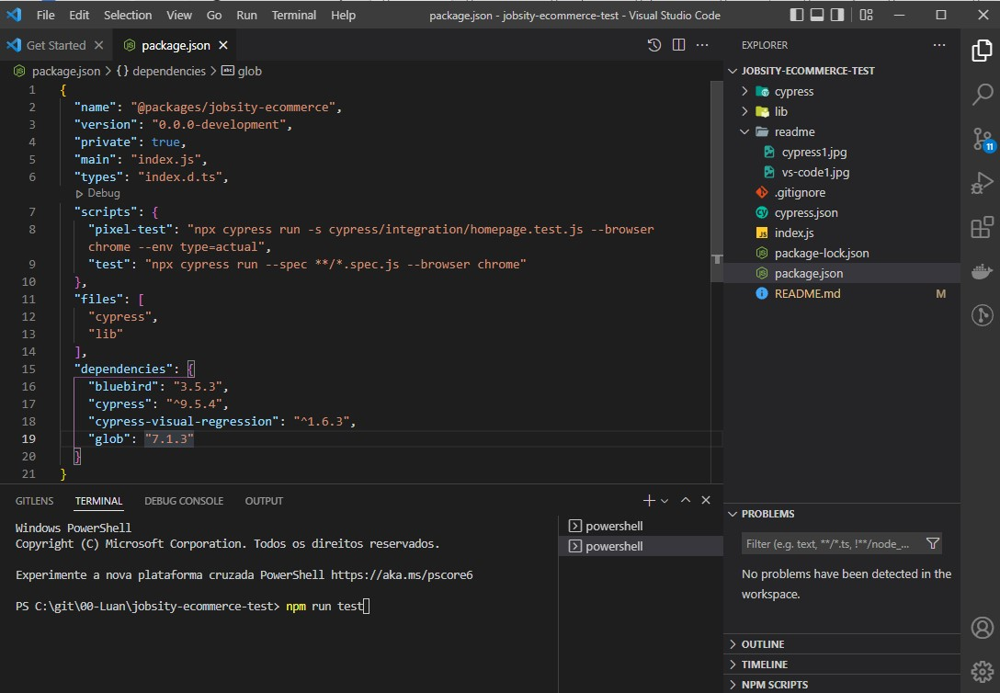
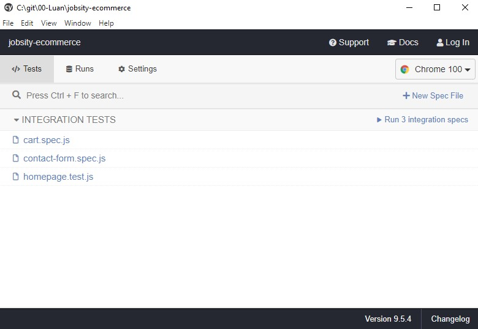

# Running the Project

1. Install NPM and Node.js. You can find more info about this topic [here.](https://docs.npmjs.com/downloading-and-installing-node-js-and-npm)
1. Extract the content of the jobsity-ecommerce-test.zip file
1. Open the terminal and access the folder where the file `package.json` is. Run: `cd jobsity-ecommerce-test`
1. Run `npm install` to install all dependencies

 

# Test Execution

To execute the tests of the cart and the contact form, execute:  

`npm run test`

To execute the pixel-perfect test in the homepage execute:  

`npm run pixel-test`

To open the cypress and execute the tests in the client, execute:

`.\node_modules\.bin\cypress open`

More info at: https://docs.cypress.io/guides/guides/command-line
 

